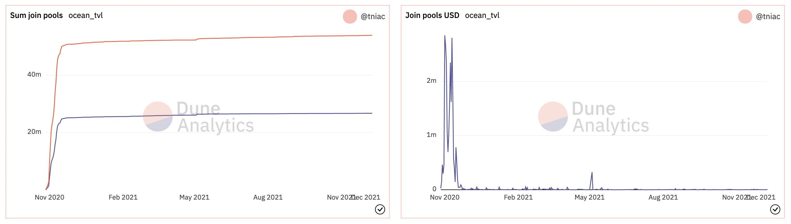

# GEB Controller Simulations for H2O

# Overview

## GEB System
[The Reflexer GEB System is a decentralized protocol that reacts to market forces in order to modify the value of a collateralized asset.](https://medium.com/reflexer-labs/stability-without-pegs-8c6a1cbc7fbd). The Reflexer GEB system allows anyone to leverage crypto assets to issue stablecoins, the first one of this kind being RAI. The goal of the system is to stabilize the secondary market price for Rai debt, using the redemption price as a stabilizer. The benefits of such stabilization is a reduction in both the volatility of the market price and its deviation from the redemption price. This increases predictability, while at the same time creating a flexible response instrument that can counteract or dampen unanticipated market shocks (such as liquidity cascades arising outside of the system).

To achieve this goal, Reflexer Labs implemented a Proportional-Integral-Derivative (PID) controller based upon a reference document approach for the [Maker DAI market](https://steemit.com/makerdao/@kennyrowe/digital-money-a-simulation-of-the-deflation-rate-adjustment-mechanism-of-the-dai-stablecoin) that was never implemented. The PID controller is the most commonly used controller type in the world, and both its modeling structure and its parameter tuning are well-researched problems.

## Goals
The [original repo](https://github.com/reflexer-labs/geb-simulations) created a cadCAD model to simulate the RAI system. This repo replicate it with OCEAN as collateral and H2O as stablecoin

# Some changes/adaptations

## Stochastic collateral price 
- From hourly historical Ocean price queried from Binance
- Generate Ocean price datasets for Monte Carlo simulation, as collateral price is an environmental parameters

## Agents capital allocations, which are defined in [liquidity.py](https://github.com/reflexer-labs/geb-simulations/blob/master/models/system_model_v3/model/state_variables/liquidity.py)
- Lower the initial balances for RAI/ETH Uniswap v2 pool
- Lower capital allocation for each agent

## New agent
- Historical value flow into Ocean marketplace 

- New agent create new Safe everyday and acts like [Safe owner agent](https://github.com/reflexer-labs/geb-simulations/blob/master/agents.md#liquidity-safes)
    - When ETH/USD goes up, the Safe owners will mint RAI, sell it for ETH and lock the ETH back into their SAFE.
    - When ETH/USD goes down, the Safe owners will unlock some ETH, buy RAI with it and pay back some of their debt.
- That moves RAI/USD away from the redemption price. 
- The model also has other agents, notably [Rate trader](https://github.com/reflexer-labs/geb-simulations/blob/master/agents.md#rai-rate-trader)
    - Has “Faith in the redemption price”: the belief about how close the market should stay to the redemption price and acts in a way that brings RAI/USD close to redemption price, explained well [here](https://medium.com/reflexer-labs/rai-system-simulations-part-2-rai-traders-e824686ef054)
- The capital allocations of the 2 agents affect the simulation results quite a lot 

## Debt ceiling

# Notebooks

- Ocean Exogenous Process

- Monte Carlo runs

- Price shocks

- Liquidity demand shock

- PID failure modes

